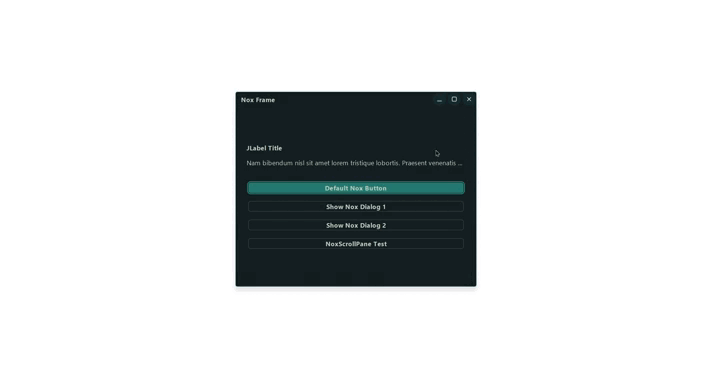

# JNox / Nox UI

A small Java Swing UI project with custom windows, dialogs, buttons, scroll panes, and SVG icons. It uses JNI on Windows to make a native-like title bar and window controls.

## Why

This project is for building a cleaner desktop UI in Swing. It gives more control over window look and user experience than standard Swing components.

## What is inside

- custom frame and dialog
- custom caption buttons
- custom option pane
- custom scroll pane and scroll bar
- SVG icon support
- Windows native bridge in C++
- sandbox/demo window

## Demo

_or put your preview here later._
